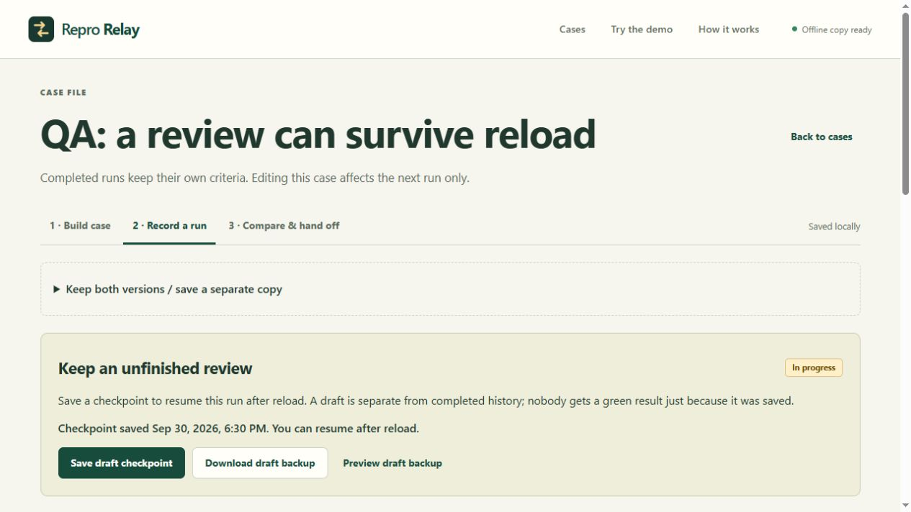

# Repro Relay

Bug feedback needs more than “it doesn't work.” Repro Relay keeps the steps, the failure and the next check in one place.

**[Try the demo](https://aaravkatiyar55-gif.github.io/repro-relay/#/demo)** · [Stardance devlog](https://stardance.hackclub.com/projects/66998/devlogs/63353)



## Try it

1. Open the fictional club board on **Broken v1** and try a check.
2. Record what happened. Switch to **Fixed v2** and repeat the same steps.
3. Save both runs as a case to compare them, or start a case for your own project.

Completed runs keep their original criteria. A changed expectation stays labelled **Criteria changed**. Blocked or untested steps don't become verified fixes.

Reviews can be paused and resumed after reload. Two-tab conflicts keep your edits available as a separate copy. Export completed history as JSON, a self-contained HTML report or issue Markdown; unfinished reviews have their own draft backup. Nothing is posted automatically.

## Run it

Node.js 24 or newer:

```sh
git clone https://github.com/aaravkatiyar55-gif/repro-relay.git
cd repro-relay
npm ci --ignore-scripts
npm run dev
```

`npm run verify` runs 28 tests, TypeScript, the build and offline-shell checks. `npm run preview` opens the production build.

## Data and limits

Cases stay in this browser. Export backups before clearing site data. PNG/JPEG evidence can be covered with opaque redactions; only the processed PNG is stored. Review it before sharing. This app records manual observations; it doesn't replay other websites or prove that a fix is correct.

[Guide](docs/GUIDE.md) · [QA and limits](docs/QA.md) · [Build notes](docs/BUILD_NOTES.md) · [Actual ship status](docs/SHIP_STATUS.md)

Aarav chose the direction and scope. Codex implemented most of the app, tests and docs and ran the recorded browser checks. This is substantially AI-assisted work. MIT licensed.
