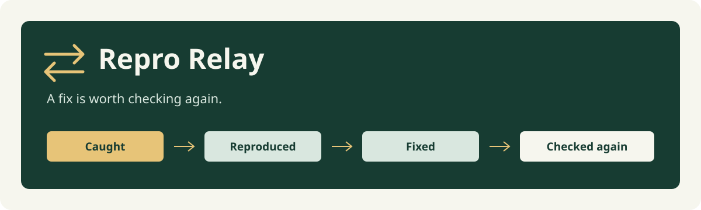
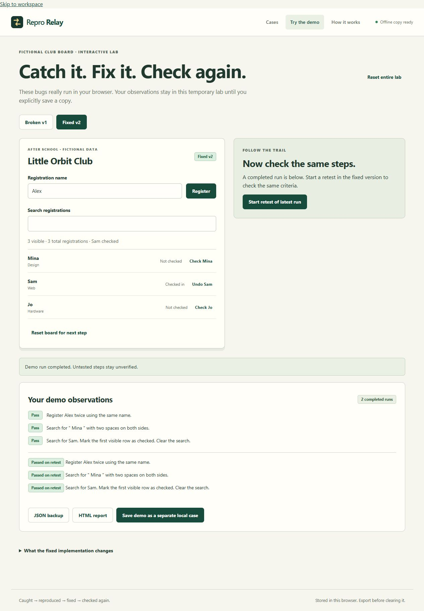
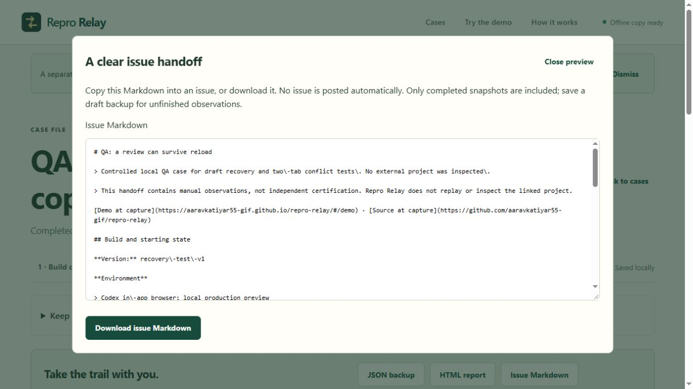
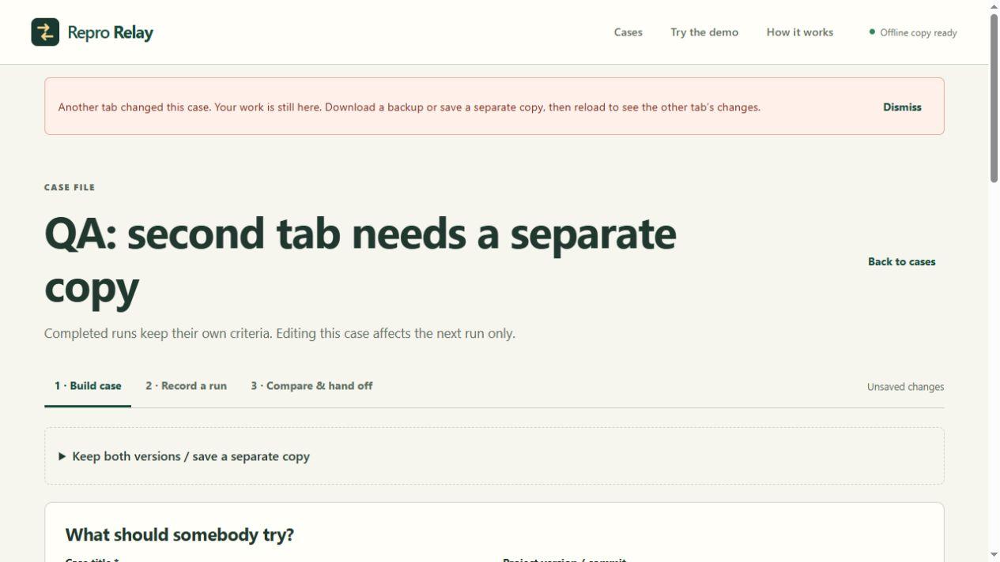
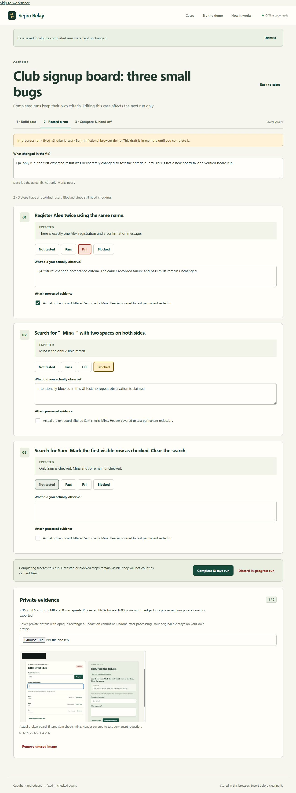

# Repro Relay

“It doesn't work” is a start. It rarely tells you which version someone tried, what they clicked, or what should have happened. Repro Relay keeps that missing context beside the fix and the next check.

**[Open the demo](https://aaravkatiyar55-gif.github.io/repro-relay/#/demo)** · [Build notes](BUILD_NOTES.md) · [Checks and their limits](QA.md) · [Ship status](SHIP_STATUS.md)

This is a small, local bug handoff tool for builders and reviewers. Write a case, record what happened, then retest the same steps after a fix. Completed runs keep their own copy of the criteria. Changing the expected result does not quietly turn an old failure green.

## Try it in a minute

1. Open **Try the demo**. The fictional Little Orbit Club board starts on Broken v1.
2. Follow a check, try the actual board, and record what you observed. Results start as **Not tested**.
3. Switch to Fixed v2 and repeat it. The board resets so the starting conditions match.
4. Save the demo as a case to keep both runs and compare them.

There are three working examples: registering Alex twice, searching for `  Mina  ` with surrounding spaces, and checking Sam while the list is filtered. The broken and fixed implementations are both included. No outside account or website is needed.



## Your own case

- **Build case:** add version and project links, environment, starting conditions, ordered actions and expected results. Step IDs stay stable when you reorder them.
- **Record a run:** mark each result Pass, Fail, Blocked or Not tested, write what happened and attach processed evidence. Use **Next unchecked step** to return to a blocked or untested check. Finish the run to freeze that observation.
- **Pause safely:** save a draft checkpoint, reload, then choose **Resume review**. The unfinished review stays separate from completed history. A draft JSON backup can carry it into another browser as a separate case.
- **Retest:** choose the earlier run, add a fix note and repeat the steps. Earlier results sit beside each step. The comparison shows resolved failures, regressions, unverified checks, changed criteria and added or removed steps; filters help you find what still needs attention.
- **Hand off:** export an editable JSON backup, a self-contained HTML report or Markdown for an issue. Previews let you inspect the text first. HTML contains the processed images; Markdown lists the PNG attachments for you to download and attach yourself. Nothing is posted automatically.

The context checklist asks whether the build, starting state, observations and fix note are recorded. It can help you share a failing case; it is not a release approval.



## If a review gets interrupted

Saving a checkpoint keeps the run's criteria, outcomes, notes and evidence references together. **Saved review checkpoint** means that snapshot can be resumed after reload. **Unsaved review draft** means you have changed something since the last checkpoint. Save again before closing the tab. Ordinary JSON and HTML exports include completed history; use **Download draft backup** or **Preview draft backup** for an unfinished run.

Two tabs can open the same case. If one saves first, the older tab is stopped from overwriting it. Its edits remain available: **Save separate copy** keeps both versions, including an unfinished run. Edits made while a save is still finishing also remain marked unsaved rather than being reported as saved.



These are manual observations. The app does not inspect external sites, replay browser sessions or certify that a reported fix is correct. JSON is a portable editable record, not a signed audit trail.

## Evidence and local data

PNG and JPEG inputs are limited to 5 MiB and 8 megapixels before decoding. The editor reduces the longest edge to at most 1600 pixels. Cover private areas by dragging rectangles or entering their coordinates with the keyboard. Processing burns opaque pixels into a new PNG; only that processed image is saved or exported. Undo is available before processing, not afterwards. The original file remains on your device.

The app checks processed image dimensions, decodability and SHA-256 on import. The digest detects mismatched bytes; it does not establish who captured an image or whether a scene is truthful. A valid import creates a separate case and leaves existing cases intact.

Cases and checkpoints live in this browser's IndexedDB, with explicit save controls. There is no server, account, analytics, remote font or runtime package. Limits are 20 cases, 12 steps and 20 completed runs per case, 6 images per case, 2 MiB per processed image, 20 MiB per imported file and 40 MiB of serialized cases and checkpoints together. These are application limits; a browser can run out of storage sooner. Export backups before clearing site data. Different browsers and deployment origins have separate storage. Existing v1 case storage is upgraded without deleting those cases.

After the first successful online load, the production service worker caches the app shell for offline use. If local saving fails, the current in-memory work can still be exported. Unsaved changes are not promised to survive closing the tab; only a successfully saved checkpoint can resume a review locally.



## Run locally

Install Node.js **24 or newer**, then:

```sh
git clone https://github.com/aaravkatiyar55-gif/repro-relay.git
cd repro-relay
npm ci --ignore-scripts
npm run dev
```

Open the local URL printed by Vite. The offline cache runs in the production build, so use these commands to check that version:

```sh
npm run verify
npm run preview
```

`verify` runs 28 tests, strict TypeScript checking, the production build and checks on the generated offline shell. The cases include snapshot isolation, comparison edge cases, malformed imports, storage failures, safe report text, shared-image exports and opaque redaction. The recovery tests add two-connection save conflicts, edits during a save, storage migration, checkpoint recovery and draft imports. Browser checks cover the real demo, reloads, image processing, imports, two tabs, keyboard controls, a 360px layout and offline previews. [QA.md](QA.md) records what was tested and what still has a practical limit.

## Where things live

| File | Purpose |
| --- | --- |
| `src/model.ts`, `src/compare.ts` | Versioned cases, frozen runs and step matching |
| `src/validation.ts`, `src/store.ts` | Strict backups and atomic IndexedDB saves |
| `src/checkpoints.ts`, `src/save-session.ts` | Resumable reviews and protection against stale saves |
| `src/images.ts`, `src/report.ts` | Processed evidence and script-free reports |
| `src/handoff.ts` | Context reminders and escaped issue Markdown |
| `src/lab.ts` | The three deliberate broken/fixed board examples |
| `src/main.ts`, `src/dom.ts`, `src/style.css` | The inspection desk and accessible controls |
| `scripts/`, `.github/workflows/pages.yml` | Offline build checks and GitHub Pages deployment |
| `test/core.test.ts`, `test/recovery.test.ts` | Core behavior and save/recovery regression checks |

The Pages workflow installs locked dependencies, runs verification, then deploys `dist`. Relative assets and hash routes let the same build run under a repository subpath.

## How this was made

The concept and scope were discussed with Aarav. **Codex implemented most of the application, tests, build setup and documentation, and operated the browser checks.** That is substantial AI assistance. The screenshots show the actual app with fictional test data; the SVG banner is an original graphic made for this repository. Bug-reporting tools already exist, and this is not a claim to the world's first invention.

The useful part of this build is the trail: **caught → reproduced → fixed → checked again**. [Build notes](BUILD_NOTES.md) explain the decisions and the bugs caught along the way. `.wakatime-project` sets the intended tracker label to `repro-relay`; it does not manufacture time. Editor-open time, accepted tracker hours, mission eligibility, reviewer approval and Stardust are separate. No reward or human-only authorship is claimed.

MIT licensed. You can keep running, changing and hosting the source without a ChatGPT subscription.
